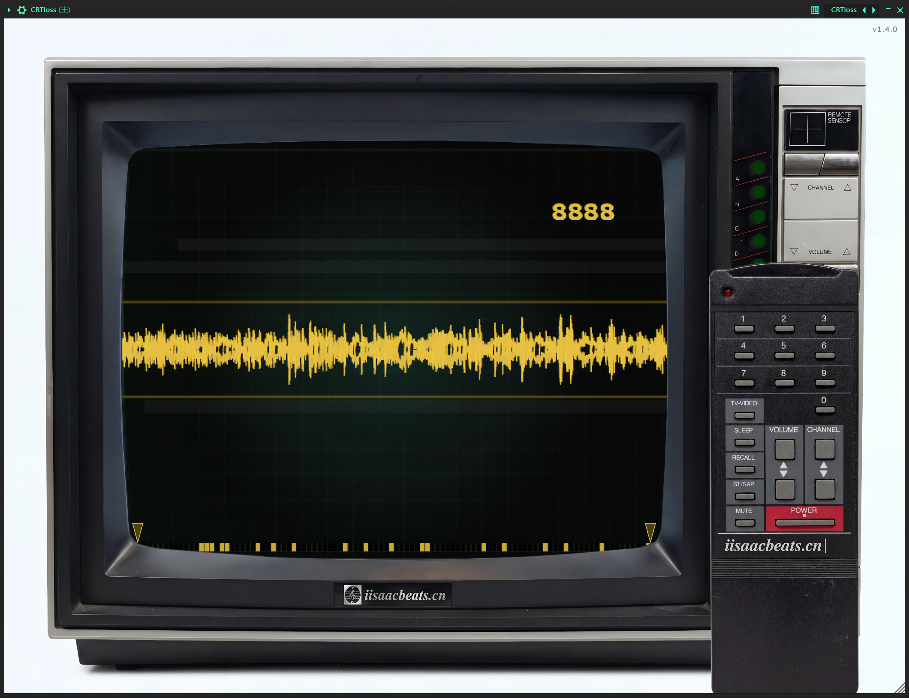
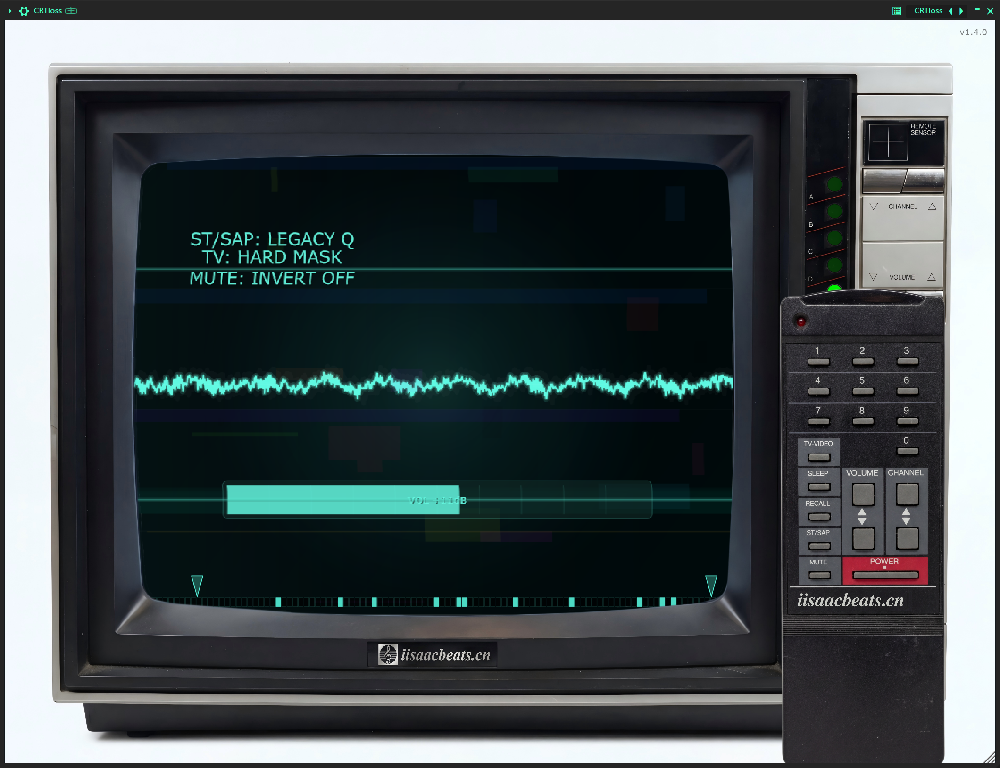

<h1 align="center">CRTloss</h1>

<p align="center"><strong>老电视机的声音 · 频道永远调不准</strong></p>

<p align="center">
  <em>丢频 · 信号衰减 · CRT 显像管</em><br>
  <em>Band Loss · Signal Decay · CRT Tube</em>
</p>

<p align="center">
  
  
  
</p>

<p align="center">
  <code>▚▚▚ NO SIGNAL ▚▚▚</code><br>
  <code>100 bands · 10000 channels · some of them are gone</code>
</p>

---

## 概述 / Overview

**CRTloss** 把声音当成一段正在衰减的电视信号：20Hz–20kHz 被切成 **100 段**，插件按照"当前频道"的规则，周期性地让其中一些频段**消失**。你听到的不是滤波器的"扫"，而是信号本身在掉帧、掉频、掉线。

> **中文**：一款模拟老式 CRT 电视机外观与质感的**丢频（band-loss）音频效果器**。12 个精心调校的固定频道 + 9888 个由频道号确定性派生的频道，三种丢频算法（IIR Notch / 等宽 Notch / FFT 频域置零），配合前置增益、硬限制器与高低切，做出从"轻微信号不良"到"彻底失锁"的退化质感。所有操作都发生在一台电视和它的遥控器上。

> **English**: A **band-loss audio effect** dressed as an old CRT television. The spectrum is split into **100 bands**; following the rules of the current "channel", some bands are periodically dropped. 12 hand-tuned presets plus 9888 deterministically derived channels, three loss algorithms (IIR notch / uniform-bandwidth notch / FFT spectral masking), plus pre-gain, a hard limiter and high/low cuts. Everything is operated on a TV set and its remote control.

> 分类 Category：Fx / Filter / Lo-Fi ｜ 插件代码 Plug-in Code：`Ldsj` ｜ 厂商 Vendor：iisaacbeats.cn

---

## 预览 / Preview

<p align="center">
  
  
</p>

<p align="center">
  <code>左̶：̷还̸收̶得̷到̸几̶个̷频̸段̶ ░ 右̶：̷已̸经̶丢̷了̸一̶半̷</code><br>
  <em>left: a few bands still coming through — right: half of them are gone.</em>
</p>

---

## 创意灵感 / Inspiration

<blockquote>
<strong>信号衰减 / Signal Decay</strong>：不是"把声音弄脏"，而是让它像一台调不准的老电视——某些频道永远差半格，画面有雪花，声音里总缺一块。

<p align="center">
<code>
▚▚▚ NO SIGNAL ▚▚▚<br>
CH 003 · CH 027 · CH 1042 · CH 9999<br>
░░░░░░▄▄▄▄▄░░░░░░<br>
20Hz ──────────── 20kHz<br>
██░░███░░████░░███░░██<br>
</code>
</p>

</blockquote>

它看起来像一台还在工作的电视，但屏幕上的东西并不完整——这正是插件对声音所做的事的视觉投影：当画面开始掉扫描线，声音也开始掉频段。

> *It looks like a TV that still works, but what's on screen is never complete — the visual projection of everything the plugin does to sound: as the picture drops scanlines, so does the audio drop bands.*

---

## 功能模块 / Modules

| 模块 / Module | 功能描述 / Description |
|------|---------|
| **丢频 Loss** | **3 种算法 × 100 段**：Legacy（固定 Q IIR Notch）/ Uniform Bandwidth（对数等宽）/ FFT-Mask（STFT 频域置零，保留相位）。<br>*3 algorithms × 100 bands: fixed-Q IIR notch / uniform-bandwidth notch / FFT spectral masking (phase preserved).* |
| **频道 Channel** | **12 个固定频道 + 频道 12..9999 确定性派生**（背景、扫描线扭曲、丢频分布、序列、高低切全部由频道号推导）。<br>*12 fixed channels + channels 12–9999 derived deterministically from the channel number.* |
| **高低切 Cut** | HardMask 硬裁 或 HPF/LPF 滤波器链（12 / 24 / 48 dB·oct），切换带 1024 采样交叉淡化。<br>*Hard mask or HPF/LPF chain (12/24/48 dB·oct) with a 1024-sample crossfade.* |
| **前置增益 Pre-Gain** | −5 ~ +24 dB，遥控器 / 电视面板 `VOL±` 每次 ±1 dB（按住连发）。<br>*−5 to +24 dB, ±1 dB per tap via remote or TV panel (auto-repeat while held).* |
| **限制器 Limiter** | 硬钳阈值 0~1，直接在屏幕内上下拖动即可调整。<br>*Hard clip threshold 0–1, draggable directly inside the screen.* |
| **遥控器 Remote** | `BYPASS` / 数字键 / `TV` / `SLEEP` / `RECALL` / `ST·SAP` / `MUTE` / `VOL±` / `CH±`，拉出即接管全部操作。<br>*Full control via the pull-out remote: bypass, digits, cut mode, freeze, recall, loss algorithm, invert, volume, channel.* |
| **示波器 & OSD** | 实时波形 + 100 格频段灯带 + 频道号 / 模式 / 音量 OSD，屏幕本身就是状态面板。<br>*Live waveform, a 100-cell band meter and multi-layer OSD — the screen is the status panel.* |
| **自动化 Automation** | 9 个参数暴露给宿主（Bypass / PreGain / Limiter / LowCut / HighCut / CutMode / CutSlope / LossAlgorithm / LossMaskInvert）。<br>*9 host-automatable parameters.* |

---

## 技术栈 / Tech Stack

| 项目 / Item | 版本 / Version |
|------|------|
| 语言 Language | C++17 |
| 框架 Framework | [JUCE](https://juce.com) 8.0.12（FetchContent 自动拉取） |
| 构建 Build | CMake ≥ 3.22 |
| 安装器 Installer | Inno Setup 6（Windows）／ pkgbuild + productbuild（macOS） |

---

## 构建 / Build

```bash
# 克隆仓库 Clone
git clone https://github.com/sweetorange1/LDSJvst.git
cd LDSJvst

# CMake 配置 & 构建（Release）
cmake -B cmake-build-release -DCMAKE_BUILD_TYPE=Release
cmake --build cmake-build-release --config Release
```

- Windows：构建成功后 VST3 会自动复制到 `%LOCALAPPDATA%\Programs\Common\VST3`（无需管理员权限）。
  *On Windows the VST3 is copied to `%LOCALAPPDATA%\Programs\Common\VST3` (no admin rights needed).*
- macOS：同时产出 `VST3` 与 `AU`（`cmake-build-release/LDSJvst_artefacts/Release/{VST3,AU}`）。
  *On macOS both `VST3` and `AU` are built.*
- 打包脚本会自动探测 `cmake-build-release` 与 `cmake-build-release-visual-studio` 两种目录名，两者均可。
  *The packaging scripts auto-detect both `cmake-build-release` and `cmake-build-release-visual-studio`.*

## 打包安装器 / Packaging

```bash
# Windows —— 需要先安装 Inno Setup 6 / Requires Inno Setup 6
build_installer.bat
# 产物 Output：dist\CRTloss_Setup_1.5.0_x64.exe

# macOS —— 需先用 Release 构建 VST3 + AU 目标
chmod +x build_installer_mac.sh
./build_installer_mac.sh          # pkg + dmg
./build_installer_mac.sh --no-dmg # 仅 pkg only
# 产物 Output：dist\CRTloss_Setup_1.5.0_macOS.pkg / .dmg
```

Windows 安装器将 VST3 装入系统目录 `C:\Program Files\Common Files\VST3\iisaacbeats.cn`（需管理员权限）；若改选其他目录，安装完成后请在 DAW 中手动添加该目录并重新扫描插件。
*The Windows installer places the VST3 into `C:\Program Files\Common Files\VST3\iisaacbeats.cn` (admin required); if you choose another folder, add it to your DAW and rescan.*

macOS 安装器同时提供 VST3（`/Library/Audio/Plug-Ins/VST3`）与 AU（`/Library/Audio/Plug-Ins/Components`）两个可选组件。
*The macOS installer ships both VST3 and AU components (selectable).*

---

## 隐私说明 / Privacy

- **更新检查 Update check**：启动后异步请求 `iisaacbeats.cn` 一次（5s 超时，失败静默），仅在有新版本时弹窗提示。
  *Async check to `iisaacbeats.cn` on startup (5s timeout, silent on failure); prompts only when a new version exists.*
- **匿名遥测 Telemetry**：每日一次匿名的"界面打开"事件（无任何音频数据、无个人身份信息），客户端为随机 UUID。
  *Anonymous "ui opened" event once per day (no audio, no PII), random client UUID.*
- 停用遥测 Disable telemetry：启动前设置环境变量 `IISAAC_TELEMETRY_DISABLED=1`。
  *Set `IISAAC_TELEMETRY_DISABLED=1` before launch.*

---

## 许可 / License

业务代码版权归 iisaacbeats.cn 所有。
*The DSP/UI/network code is © iisaacbeats.cn.*

第三方组件 Third-party：

| 组件 / Component | 许可 / License |
|------|------|
| JUCE 8 | GPL-3.0 / 商业双授权 GPL-3.0 / commercial dual |

---

<p align="center">
  <code>▚̷̢̛▚̸̧̟▚̷̛̗▚̸̨̘▚̷̢̹▚̸̛̫ NO̶ S̷I̸G̶N̷A̸L̶</code><br>
  <em>让声音像信号一样丢失。</em><br>
  <em>Let the sound drop out like a signal.</em><br><br>
  &copy; 2024-2026 iisaacbeats.cn
</p>
